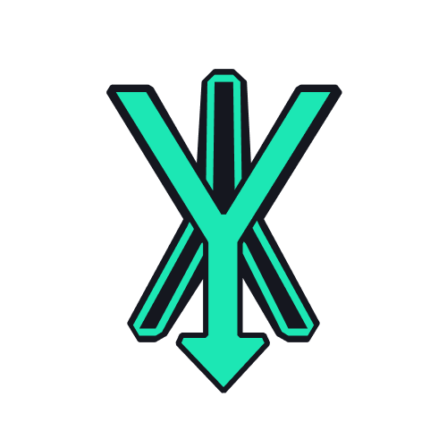

# Mdyna

### A notes app with Markdown support and code syntax highlighting

_Built with React+Redux+Electron_

### Main Features

- Git Flavoured Markdown (GFM) support
- Code syntax highlighting for several languages
- Dark Mode
- Tag notes with labels

### Scripts

- Install dependencies
  `yarn install-all`

- Start application
    `yarn start`

- Build binaries
    `yarn pack-build`

- Update Icons
    `yarn create-icons`

- Pack ASAR
    `yarn pack-asar`

- Publish App
    `yarn publish-app`

